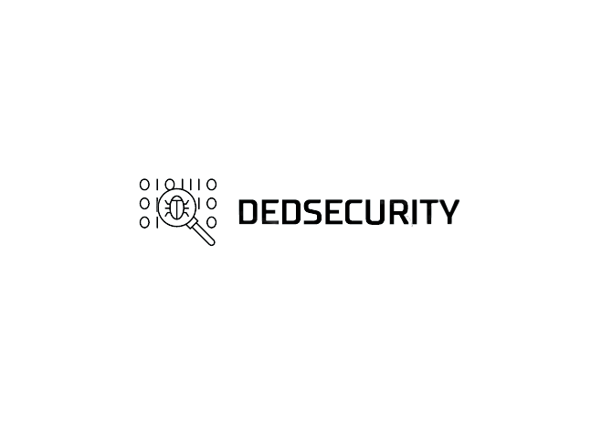

<h1 align="center"></h1>

<h1 align="center"> Ded Security Codes</h1>

```bash
Website:  https://www.dedsecurity.com
Author:   Simon Kinjo
Maintenance:  Simon Kinjo
```

>Ded Security Codes is an artificial intelligence tool 
>developed by Ded Security to assist users through code auto-completion.
---

## Installation

Make sure you have installed the dependencies:

  * `python` 3
  * `git`

Clone the [source] with `git`:
 ```sh
   git clone https://github.com/dedsecurity/codes
   cd codes
   ```
   
Use the package manager [pip](https://pip.pypa.io/en/stable/) to install the libraries.

```bash
pip install -r requirements.txt
```

 [source]: https://github.com/dedsecurity/codes

---

## Contributing
Feel free to submitting pull requests to us.
## License
[MIT](https://opensource.org/licenses/MIT)
